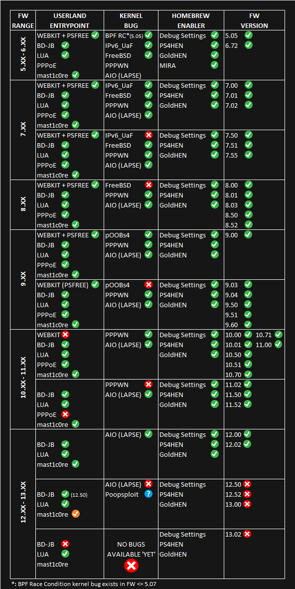
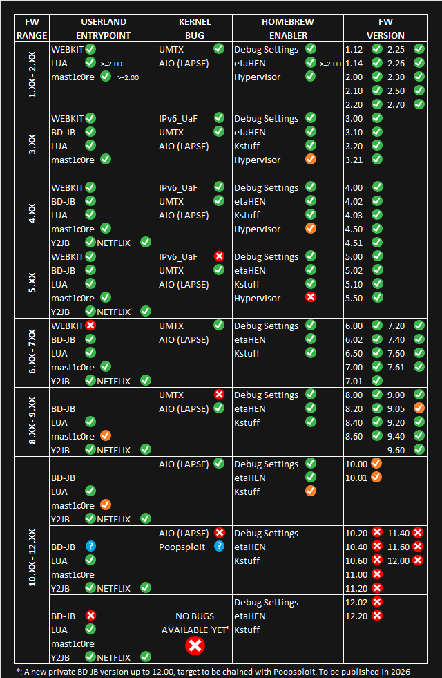

# PlayStation Jailbreak Status Nov 12th 2025

  <table>
    <tr>
      <td>
        
      </td>
      <td>
        
      </td>
    </tr>
    <tr>
      <td align="center">
        Playstation 4
      </td>
      <td align="center">
        Playstation 5
      </td>
    </tr>
  </table>

## Description
This repository contains Excel file that document the jailbreak status of PlayStation 4 and PlayStation 5 firmware versions.
The file provides information about the availability of userland entrypoints, kernel exploits, and homebrew enablers for different firmware versions.
The goal is to simplify version-based tracking and provide a community-verifiable reference.

⚠️ This repository does not provide jailbreak instructions or exploit code — it only summarizes version status and metadata.

## Disclaimer
This project is for **informational purposes only**. The data listed here is collected from publicly available sources and community contributions.
You are responsible for complying with the laws of your country regarding device modification.
No exploit code or payloads included in this repository.

## Acknowledgments
Special thanks to the community, developers, and testers who continue to share knowledge and contribute to research.
Thanks to everyone who reports updates and keeps project alive! 🙌
